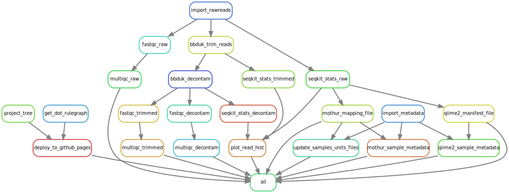

<link rel="preconnect" href="https://fonts.googleapis.com">
<link rel="preconnect" href="https://fonts.gstatic.com" crossorigin>
<link href="https://fonts.googleapis.com/css2?family=Montserrat&display=swap" rel="stylesheet">
<link rel="preconnect" href="https://fonts.googleapis.com/css2?family=Anton&display=swap" rel="stylesheet">


```{r echo=FALSE, message=FALSE, warning=FALSE}
knitr::opts_chunk$set(
  echo = FALSE,
  message = FALSE,
  warning = FALSE,
  cache = FALSE,
  comment = NA,
  fig.path='./figures/',
  fig.show='asis',
  dev = 'png',
  fig.align='center',
  out.width = "70%",
  fig.width = 7,
  fig.asp = 0.7,
  fig.show = "asis"
)

library(tidyverse, suppressPackageStartupMessages())
library(schtools)

```

<br><div id="inprogress"><h3> ...Work In Progress!... </h3> </div><br><br>

> We continuously review and integrate the old iMAP [@TMBuza2019] with Snakemake and GitHub actions to facilitate reproducible microbiome data analysis!

<br><hr width=100%><br>

# General Overview

- We use the snakemake workflow management system [@Koster2021; @Snakemake2023] for:
  - Maintaining reproducibility in technical validation and regeneration of results.
  - Creating scalable data analysis scaled to server, grid or cloud environment.
  - Fostering sustainable improvement of the microbiome data analysis.
- We also review existing workflows [@Snakemake2023; @Mothursnakemake] to help in gaining a better insights for improving microbiome data analysis.
- We break any complex workflows into small contiguous but related chunks where each major step form a separate executable snakemake rule.

<br>

> We envision to keep fostering on continuous integration and development of highly reproducible workflows.

<br>

## Snakemake rule DAG
- Typically the snakemake workflow is defined by specifying rules.
- The rule-graph graphically shows the input-output files. 
- The snakemake is capable of automatically determining the dependencies between the rules and creates a dot-like DAG (Directed Acyclic Graph).

<br><br>
Quality control snakemake workflow.

<br><br>

## Screenshot of Snakemake HTML report {#smkreport}
> The snakemake html report can be viewed using any compartible browser, such as chrome to explore more on the workflow and the associated statistics. You will be able to close the left bar to get a better wider view of the display.


<br><br><hr width=100%><br><br>

# Read Quality Control 

## Raw reads


<br><br>

## Trimmed reads


<br><br>

## Decontaminated reads


<br><br>

## Processed read status


<br><br>


```{block, echo=TRUE}
# Related work
> Here we show the IMAP Repos integrated with Snakemake and GitHub Actions!

| Repo | Description | Summary |
|-------------------------|---------------------------------------------------|-----------------|
| [IMAP-PART1](https://github.com/tmbuza/imap-requirements/) | Preparing for Microbiome Data Analysis | [GH-Pages](https://tmbuza.github.io/imap-requirements/) |
| [IMAP-PART2](https://github.com/tmbuza/imap-bioinformatics/) | Bioinformatics Analysis of Microbiome Data | [..In Progress..](https://tmbuza.github.io/imap-bioinformatics/) |
| [IMAP-PART3](https://github.com/tmbuza/imap-data-preprocessing/) | Microbiome Data Preprocessing | [..In Progress..](https://tmbuza.github.io/imap-data-preprocessing/) |
| [IMAP-PART4](https://github.com/tmbuza/imap-exploratory-analysis/) | Exploratory Analysis of Microbiome Data | [..In Progress..](https://tmbuza.github.io/imap-exploratory-analysis/) |
| [IMAP-PART5](https://tmbuza.github.io/imap-machine-learning/) | Microbiome Machine Learning | [..In Progress..](https://tmbuza.github.io/imap-machine-learning/) |

<br>

## Citation
  > Please consider citing the [iMAP article](https://rdcu.be/b5iVj) (see below) if you find any part of the IMAP practical user guides helpful in your microbiome data analysis.

  **APA-like citation style**

  Buza, T. M., Tonui, T., Stomeo, F., Tiambo, C., Katani, R., Schilling, M., … Kapur, V. (2019). iMAP: An integrated bioinformatics and visualization pipeline for microbiome data analysis. BMC Bioinformatics, 20. https://doi.org/10.1186/S12859-019-2965-4

  > Please, help to increase awareness of freely available microbiome data analysis tools.
  Current [iMAP manuscript dimensions](https://badge.dimensions.ai/details/id/pub.1117740326)

<br><br><hr width=50%><br><br>

# Appendix {-}

## Troubleshooting (in progress)
<ol>
  <li>?</li>
  <ul>
    <li></li>
  </ul>

  <li>?</li>
  <ul>
    <li></li>
  </ul>
</ol>

<br><br><hr width=50%><br>

## References
::: {#refs}
:::

<br><br><hr width=100%><br>

<div id="footer">
Last updated on `r format(Sys.time(), '%B %d, %Y')`. <br><br>
The snakemake workflow mentioned in this report is continuously being reviewed, integrated, tested and compiled by [`r rmarkdown::metadata$author`](mailto:`r rmarkdown::metadata$email_address`).  
Github_Repo: `r rmarkdown::metadata$github_repo`.  
Related Website: `r rmarkdown::metadata$related_website`.  

</div><br><br>
